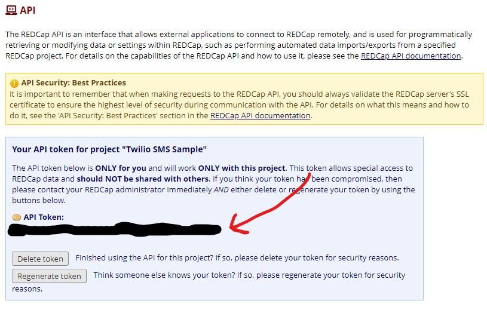

## Sample REDCap Project
The REDCap survey software is administered by the organization and requests for REDCap APIs must be made and approved before it can be added to a user of a project. Luckily  REDCap offers a way to [try the survey platform for 1 week](https://www.project-redcap.org/software/try/). 

> **All survey instruments will be deleted after one week and the account will be de-activated. Save any surveys to import into production projects before the trial ends**

This is the signup page

Once you have signed up you can make your sample project

Make sure to enable surveys in the project

Next you can go to online designer to add instruments project

On the online designer page you can create instruments or upload samples provided in the data directory: [Smslog_template.zip](Smslog_template.zip) and [SampleSms_template.zip](SampleSms_template.zip)

**Make sure to upload the sms_log_template** This is important to be able to log the sms messages being sent

It is also improtant to **Enable** the instrument as survey. This is not necessary for the sms_log

Last is there needs to be a survey to pull the phone number from in order to text. There are other ways to use phone numbers in project, but for simplicity there is a simple survey for name and phone number.

Included in [SmsSampleParticipant_template.zip](SmsSampleParticipant_template.zip)
> **This must be completed by a researcher in the REDCap software for sample to work**

## REDCap API

To enable API you must change the permission under **User Rights** section

Notice there is an "X" in the API section

Click on the user name (usually email address) 

Click "Edit user privileges"

 Add checks next to the API options:
 Click "Edit user privileges" and save

 
 Now on side there will be an API option:
 > NOTE: Might require a page refresh

Click the request token and a new API token will be generated. 

> API tokens are project specific.

To run sample the config file needs:
- **API token**
- **REDCap API URL**

## Twilio

1. Sign up for a free trial account at [twilio.com](https://www.twilio.com/)

2. Once you sign up you receive $15 in prepaid to test services

3. Need 3 pieces of information to connect to [Twilio API](https://www.twilio.com/docs/usage/api)
    - **Account SID**
    - **Auth Token**
    - **Twilio Phone number**
> set this infomation in the config file

4. The first **Account SID** and **Auth Token** are in dashboard
5. The phone number needs to be purchased.
    - There are defined number for trial account, production account allows users to choose number.
    - Phone number is $1
    - SMS are $0.0075 per outgoing message